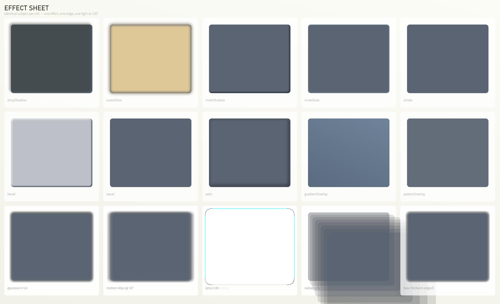

# DSH Graphic Design Agent

一个**平面设计专职 Agent**，连同它驱动的渲染引擎、交给它使用的工具链，以及它的产出。

不是 prompt 合集，也不是 API 封装。核心判断来自一次真实任务的复盘：

> **设计能力的瓶颈不在生成，在于「判断」与「验证」。**
> 我失败最多的不是「我画不出来」，而是「我画出来了，却不知道对不对」。

整条工具链因此**偏向测量而非绘制**：8 个工具里只有 `design_render` 出图，其余用来回答
「这张参考图到底用了什么数值」「焦点是否唯一」「强调色占了多少」「字溢出了没有」。

---

## 三样东西 + 环境

```
DSH_GraphicDesign_Tools/
├── design/       ← AGENT：preset 的规范源（8 工具 + 7 技能 + 常驻审美纪律）
├── engine/       ← 工具：Node 渲染引擎、25 个会话工具、Photoshop 桥
├── examples/     ← 产出：3 张成品图（进仓库的精选）
├── docs/         ← 说明：需求简报 + 交接 + 复盘
├── deploy-preset.mjs   ← 环境：把 design/ 装进 harness
├── make-examples.mjs   ← 环境：从 out/ 提升精选成品
└── REPO-LAYOUT.md      ← 每个目录的归属与上传边界（先读这个）
```

**完整分类见 [`REPO-LAYOUT.md`](REPO-LAYOUT.md)。** 一句话：`design/` 是 agent，
`engine/` 是它的工具，`examples/` 是它的作品。

---

## 快速开始

```powershell
# 1. 依赖（只有一个：@napi-rs/canvas，含平台原生二进制）
cd engine; npm install

# 2. 生成工作区外围（素材库 / 项目区 / 缓存）—— 幂等，可随时再跑
cd ..; node bootstrap-workspace.mjs

# 3. 全部测试：15 套、413 项断言
cd engine; node test/run-all.mjs

# 4. 出一张图试试
node bin/design.mjs render scenes/poster-e-tooled.json --out out --name try

# 5. 把 agent 装进 harness
cd ..; node deploy-preset.mjs

# 6. 开一个新项目
node new-project.mjs my-first-kv
```

然后在 DSH 里开一个**选中「设计」预设**的新会话。

> 仓库不在本文件假设的路径时：`$env:DSH_DESIGN_ENGINE = "$PWD\engine"`。
> 这是唯一的绝对路径依赖，且现在有环境变量回退。

### 工作区里什么在哪

仓库只是工作区的一半。旁边三块区域**不进版本控制**，由 `bootstrap-workspace.mjs` 自动生成：

```
D:\DSH_GDT\                     ← 工作区
├── DSH_GraphicDesign_Tools\    ← 本仓库（源码、文档、精选示例）
├── assets\                     ← 共享素材库：通用素材，每次生成都读
├── projects\<YYYY-MM-DD-slug>\ ← 项目：自带 scenes/ assets/ out/
├── .cache\                     ← 生成缓存，可随时删
└── refs\                       ← 参考素材（用来量，不交付）
```

**素材放哪的判据**：两个项目都会用到 → `assets/`；只服务一个项目 → 那个项目的 `assets/`。
两处都留一份必然走样，提升到共享库要**移动**而不是复制。完整规则见
[`REPO-LAYOUT.md`](REPO-LAYOUT.md) §五之三。

---

## 引擎能做什么

```powershell
node bin/design.mjs render   <scene.json> --out out --name X [--psd]  # 渲染 + 度量 + 设计校验 + 分层 PSD
node bin/design.mjs analyze  <image>                                  # 参考图 → 可执行规格（不是描述）
node bin/design.mjs critique <png>                                    # 四问自检
node bin/design.mjs verify   <scene.json>                             # 反模式硬约束
node bin/design.mjs fonts | ladder | ramp                             # 设计系统原语
node bin/design.mjs palette  <子命令>                                 # 滤镜词汇表（算子图）
node bin/design.mjs tool     --list                                   # 25 个会话工具的名册
```

**场景是声明式的**：一块画布、一个底色、一叠图层（rect / ellipse / line / polygon /
path / text / image / group / adjustment）。长度 ≤1 是画布比例，>1 是像素。
**每次渲染同时返回量测报告**——每层的实际几何、文字是否溢出、是否发生了静默字体回退、
蒙版保留率、网点数量与覆盖率。

设计层面另有 17 个图层效果、16 种混合模式、`scope`（把处理限制在某个区域，
这是让双色调避开人脸的办法），以及不依赖 Photoshop 的分层 PSD 写出。

---

## 示例



| 文件 | 内容 |
|---|---|
| [`examples/poster-variants-and-scope.png`](examples/poster-variants-and-scope.png) | 同一版式**六种处理**对照并带标注：flat / soft / press / light / tooled / **scoped**。最后一张是重点——C 与 F 用同一套双色调加网点，`scope` 让它避开人脸。 |
| [`examples/poster-e-tooled.png`](examples/poster-e-tooled.png) | 成品海报，交付尺寸 **2400×1350**。 |

（只有效果表内嵌，另两张用链接——它们是 1–2 MB 的 2400px 成品图，内嵌会让仓库首页加载过重。）

每条图的重出命令见 [`examples/README.md`](examples/README.md)。

---

## 两条纪律（都来自踩过的坑）

1. **约束在被绘制的几何上求值；审计不得重新推导它所检查的约定。**
   用一个点代替一个框、用「两点距离小于半径和」代替「两个矩形是否相交」，是同类错误
   连续发生六次、每次都报「0 问题」的原因。
2. **改源码用编辑工具，不用 shell。**
   `Get-Content -Raw | Set-Content` 会把 UTF-8 按系统 ANSI 编解码，中文全变乱码，
   更隐蔽的是**多字节字符撑开分隔符、把下一行代码吞进 `//` 注释**——那行永不执行，
   而报告全绿。

---

## 状态

引擎 15 套测试全绿（`node test/run-all.mjs`，exit 0）；preset 挂载通过。
**尚未在真实会话中运行过**——`design` preset 从未被任何一次会话选中，`design_render`
也从未被真正调用过。挂载、schema、引擎三条都有验证，「模型能调得动这 8 个工具」还缺
一次真实运行。

### 关于「克隆下来能做什么」

这个仓库交付的是**工具链**，不是这台机器的旧成品。所以：

- ✅ 引擎、25 个会话工具、8 个 preset 工具、**全部 15 套测试**——开箱可用；
- ❌ `engine/scenes/*.json` 与 `examples/` 里的图**重不出来**：它们的素材
  （`engine/assets/`、`engine/refs/`）是本机专用的输入，刻意未纳入版本控制，
  且场景里的 `src` 是绝对路径。

测试套件已专门改成自给自足（不再加载 `engine/assets/`，也不再写死任何
per-machine 路径），所以克隆的人可以**先验证工具链，再用它做自己的东西**。
细节见 [`examples/README.md`](examples/README.md) 与 [`REPO-LAYOUT.md`](REPO-LAYOUT.md) §三。

已知缺口完整清单见 [`REPO-LAYOUT.md`](REPO-LAYOUT.md) §八。
